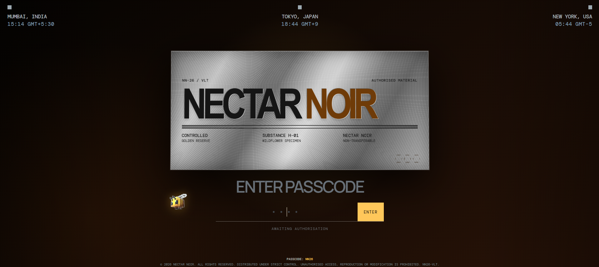
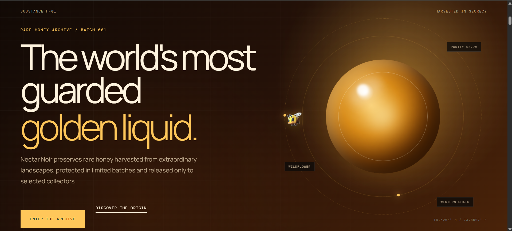
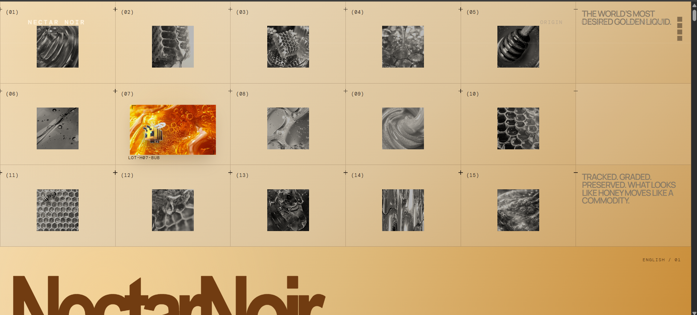
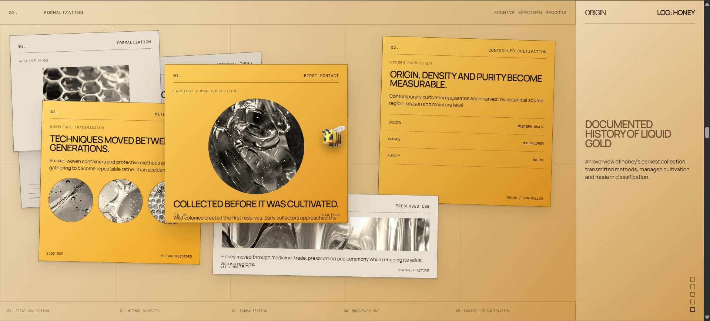

# 🍯 Nectar Noir

A cinematic luxury honey archive experience inspired by premium storytelling websites.

Nectar Noir transforms the journey of honey into an interactive digital archive where every scroll reveals a new chapter—from hidden harvests to preserved history.

---

## 🌐 Live Demo

👉 https://ishikasarvesh.github.io/nectar-noir/

*(Update after hosting on GitHub Pages.)*

---

# Preview

## Access Gate



---

## Hero Section



---

## Honey Archive Grid



---

## Historical Timeline



---

# Features

- Secure metallic access gate
- Animated passcode system
- Cinematic archive storytelling
- Interactive honey archive grid
- Hover reveal image transitions
- Floating archive file animation
- Honey preparation chapter
- Dealer archive
- Custom LEGO Bee cursor
- GSAP powered animations
- Lenis smooth scrolling
- Responsive layout
- Luxury amber design system

---

# Tech Stack

- HTML5
- CSS3
- JavaScript (ES6)
- GSAP
- ScrollTrigger
- Lenis
- Vite

---

# Folder Structure

```
nectar-noir
│
├── assets
├── public
├── screenshots
│   ├── 01-access-gate.png
│   ├── 02-hero.png
│   ├── 03-texture-archive.png
│   └── 04-history-cards.png
│
├── src
├── README.md
├── package.json
└── vite.config.js
```

---

# Installation

Clone the repository

```bash
git clone https://github.com/YOUR_USERNAME/nectar-noir.git
```

Go inside project

```bash
cd nectar-noir
```

Install dependencies

```bash
npm install
```

Run locally

```bash
npm run dev
```

Build

```bash
npm run build
```

---

# Future Improvements

- Honey Vault Experience
- Ambient Sound Design
- WebGL Honey Simulation
- Seasonal Honey Collections
- Collector Authentication
- 3D Interactive Honey Globe

---

# Developer

Designed & Developed by

**Ishika Sawant**

B.Tech Information Technology

Creative Frontend Developer

UI/UX Designer

---

## License

This project is licensed under the MIT License.